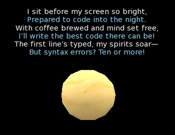
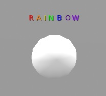

## Floating texts

<h4>Basic</h4>

A basic floating text with the name of the owner

<pre class="language-slua"><code class="language-slua">-- basic floating text with a fixed text

local text = "I'm owned by " .. ll.GetDisplayName(ll.GetOwner())
local color = vector(1.000, 0.255, 0.212)  -- red
local alpha = 1.0

ll.SetText(text, color, alpha)</code></pre>

<h4>Color change</h4>

A floating text that changes its color with a timer

<pre class="language-slua"><code class="language-slua">-- floating text with a fixed text and changing colors

local COLOR = {
    NAVY =   vector(0.000, 0.122, 0.247),  BLUE =    vector(0.000, 0.455, 0.851),
    AQUA =   vector(0.498, 0.859, 1.000),  TEAL =    vector(0.224, 0.800, 0.800),
    OLIVE =  vector(0.239, 0.600, 0.439),  GREEN =   vector(0.180, 0.800, 0.251), 
    LIME =   vector(0.004, 1.000, 0.439),  YELLOW =  vector(1.000, 0.863, 0.000),
    ORANGE = vector(1.000, 0.522, 0.106),  RED =     vector(1.000, 0.255, 0.212),
    MAROON = vector(0.522, 0.078, 0.294),  FUCHSIA = vector(0.941, 0.071, 0.745),
    PURPLE = vector(0.694, 0.051, 0.788),  WHITE =   vector(1.000, 1.000, 1.000),
    SILVER = vector(0.867, 0.867, 0.867),  GRAY =    vector(0.667, 0.667, 0.667),
    BLACK =  vector(0.067, 0.067, 0.067)
}

local colors = { COLOR.WHITE, COLOR.GREEN, COLOR.RED }  -- any colors

local text = "I'm owned by " .. ll.GetDisplayName(ll.GetOwner())
local alpha = 1.0
local colorCounter = 1

function timer()
    local color = colors[colorCounter]
    ll.SetText(text, color, alpha)

    colorCounter += 1
    if colorCounter > #colors then
        colorCounter = 1
    end
end

ll.SetTimerEvent(0.5)</code></pre>

<h4>Text change</h4>

A floating text that changes colors listens for a new text

<pre class="language-slua"><code class="language-slua">-- floating text with changing text and changing colors

local COLOR = {
    NAVY =   vector(0.000, 0.122, 0.247),  BLUE =    vector(0.000, 0.455, 0.851),
    AQUA =   vector(0.498, 0.859, 1.000),  TEAL =    vector(0.224, 0.800, 0.800),
    OLIVE =  vector(0.239, 0.600, 0.439),  GREEN =   vector(0.180, 0.800, 0.251), 
    LIME =   vector(0.004, 1.000, 0.439),  YELLOW =  vector(1.000, 0.863, 0.000),
    ORANGE = vector(1.000, 0.522, 0.106),  RED =     vector(1.000, 0.255, 0.212),
    MAROON = vector(0.522, 0.078, 0.294),  FUCHSIA = vector(0.941, 0.071, 0.745),
    PURPLE = vector(0.694, 0.051, 0.788),  WHITE =   vector(1.000, 1.000, 1.000),
    SILVER = vector(0.867, 0.867, 0.867),  GRAY =    vector(0.667, 0.667, 0.667),
    BLACK =  vector(0.067, 0.067, 0.067)
}

local CHANNEL_FLOATING_TEXT = 11

local colors = { COLOR.WHITE, COLOR.GREEN, COLOR.RED }  -- any colors

local text = "Say a text in channel 11"
local alpha = 1.0
local colorCounter = 1

function timer()
    local color = colors[colorCounter]
    ll.SetText(text, color, alpha)

    colorCounter += 1
    if colorCounter > #colors then
        colorCounter = 1
    end
end

function listen(channel, name, id, message)
    if channel == CHANNEL_FLOATING_TEXT then
        text = message
    end
end

ll.Listen(CHANNEL_FLOATING_TEXT, "", ll.GetOwner(), "")
ll.SetTimerEvent(0.5)
</code></pre>

<h4>Text alternance</h4>

A floating that listens for two text in two channels, alternates the text and changes the colors, with different timings

<pre class="language-slua"><code class="language-slua">-- floating text with double changing text and changing colors

local COLOR = {
    NAVY =   vector(0.000, 0.122, 0.247),  BLUE =    vector(0.000, 0.455, 0.851),
    AQUA =   vector(0.498, 0.859, 1.000),  TEAL =    vector(0.224, 0.800, 0.800),
    OLIVE =  vector(0.239, 0.600, 0.439),  GREEN =   vector(0.180, 0.800, 0.251), 
    LIME =   vector(0.004, 1.000, 0.439),  YELLOW =  vector(1.000, 0.863, 0.000),
    ORANGE = vector(1.000, 0.522, 0.106),  RED =     vector(1.000, 0.255, 0.212),
    MAROON = vector(0.522, 0.078, 0.294),  FUCHSIA = vector(0.941, 0.071, 0.745),
    PURPLE = vector(0.694, 0.051, 0.788),  WHITE =   vector(1.000, 1.000, 1.000),
    SILVER = vector(0.867, 0.867, 0.867),  GRAY =    vector(0.667, 0.667, 0.667),
    BLACK =  vector(0.067, 0.067, 0.067)
}

local CHANNEL_FLOATING_TEXT_1 = 11
local CHANNEL_FLOATING_TEXT_2 = 12

local colors = { COLOR.WHITE, COLOR.GREEN, COLOR.RED }  -- any colors

local text1 = "Say a text in channel 11"
local text2 = "Say a text in channel 12"
local text = text1
local alpha = 1.0
local colorCounter = 1
local currentText = 1
local textTicks = 30

function timer()
    local color = colors[colorCounter]
    ll.SetText(text, color, alpha)

    colorCounter += 1
    if colorCounter > #colors then
        colorCounter = 1
    end

    textTicks -= 1
    if textTicks == 0 then
        if currentText == 1 then
            currentText = 2
            text = text2
        else
            currentText = 1
            text = text1
        end
        textTicks = 30
    end
end

function listen(channel, name, id, message)
    if channel == CHANNEL_FLOATING_TEXT_1 then
        text1 = message
        currentText = 2  -- force the change to the new message
        textTicks = 1    -- in the next timer
    elseif channel == CHANNEL_FLOATING_TEXT_2 then
        text2 = message
        currentText = 1  -- force the change to the new message
        textTicks = 1    -- in the next timer
    end
end

ll.Listen(CHANNEL_FLOATING_TEXT_1, "", ll.GetOwner(), "")
ll.Listen(CHANNEL_FLOATING_TEXT_2, "", ll.GetOwner(), "")
ll.SetTimerEvent(0.5)
</code></pre>

<h4>Horizontal scrolling</h4>

A floating text that scrolls horizontally from left to right (Halloween ambient)

<pre class="language-slua"><code class="language-slua">-- floating text with horizontal scrolling

local MESSAGE_LENGTH = 25  -- characters displayed in the floating text

-- any long text, with a white space at the end
local text = "🎃 Beware! This object may be haunted! 👻 Touch if you dare… but don’t say I didn’t warn you! 💀✨. "

local textLength = ll.StringLength(text)  -- not #text, it has unicode
local textPos = 0  -- index base 0 to use with LL string functions

if textLength < MESSAGE_LENGTH then  -- in case that the text is too short, no scrolling
    MESSAGE_LENGTH = textLength
end

local color = vector(1.000, 1.000, 1.000)  -- white
local alpha = 1.0

function touch_start(num_detected)
    ll.RegionSayTo(ll.DetectedKey(0), 0, "👻 Boo! You shouldn’t have touched that… Now I’m awake! 💀")
    color = vector(1.000, 0.255, 0.212)  -- red
end

function timer()
    local textShown = ll.GetSubString(text .. text, textPos, textPos + MESSAGE_LENGTH - 1)
    -- text..text to get the end and the start in one call
    -- with text="Hello world ", textPos=6 and MESSAGE_LENGTH=12 is:
    -- ll.GetSubstring("Hello world ".."Hello world ",6,6+12-1)  -- > world Hello

    ll.SetText(textShown, color, alpha)
    textPos += 1
    if textPos == textLength then
        textPos = 0
    end
end

ll.SetTimerEvent(0.25)</code></pre>

<h4>Vertical scrolling</h4>

A floating text that scrolls vertically from the bottom (Halloween ambient)

<pre class="language-slua"><code class="language-slua">-- floating text with vertical scrolling

local MESSAGE_LINES = 5  -- lines displayed in the floating text

-- any text with many short lines
local text = {
    "🎃 Welcome, brave soul!",
    "Step right up to this haunted heap!",
    "Touch if you dare, but beware!",
    "You might unleash a spirit...",
    "Or just an old pizza crust.",
    "Who knows what lurks in here? 👀",
    "A ghost? A goblin?",
    "Or maybe... just a really bad smell? 💀",
    "Proceed with caution, or a clothespin!",
    "Happy Haunting! 👻✨"
}

local textPos = 1

-- the length of an array table is stored with the table, not calculated
-- no need of local textLines = #text, using #text each time is fast enough
if #text < MESSAGE_LINES then  -- in case that the text is too short, no scrolling
    MESSAGE_LINES = #text
end

local color = vector(1.000, 1.000, 1.000)  -- white
local alpha = 1.0

function touch_start(num_detected)
    ll.RegionSayTo(ll.DetectedKey(0), 0, "👻 Boo! You shouldn’t have touched that… Now I’m awake! 💀")
    color = vector(1.000, 0.255, 0.212)  -- red
end

function timer()
    local textShown = {}
    -- using table.insert and table.concat is more efficient that concatenating to a string
    -- this is just an example, it's not important with a few substrings
    for i = textPos, textPos + MESSAGE_LINES - 1 do
        table.insert(textShown, text[ if i > #text then i - #text else i ])  -- inline-if to wrap the index
    end
    ll.SetText(table.concat(textShown, "\n"), color, alpha)
    textPos += 1
    if textPos > #text then
        textPos = 1
    end
end

ll.SetTimerEvent(5)</code></pre>

<h4>Bicolor</h4>

A floating text that scrolls using two colors for alternating lines:

Floating text have only one color, and prims only one floating text.

We need two identical prims rezzed in the same position, each prim shows half of the lines in one color.

The script must be in both prims. It identifies what text and color to display with the prim description. The descriptions must be "floating 1" and "floating 2", as defined in the table primDecs in the script.

<pre class="language-slua"><code class="language-slua">-- floating text with vertical scroll in two colors

local COLOR = {
    NAVY =   vector(0.000, 0.122, 0.247),  BLUE =    vector(0.000, 0.455, 0.851),
    AQUA =   vector(0.498, 0.859, 1.000),  TEAL =    vector(0.224, 0.800, 0.800),
    OLIVE =  vector(0.239, 0.600, 0.439),  GREEN =   vector(0.180, 0.800, 0.251), 
    LIME =   vector(0.004, 1.000, 0.439),  YELLOW =  vector(1.000, 0.863, 0.000),
    ORANGE = vector(1.000, 0.522, 0.106),  RED =     vector(1.000, 0.255, 0.212),
    MAROON = vector(0.522, 0.078, 0.294),  FUCHSIA = vector(0.941, 0.071, 0.745),
    PURPLE = vector(0.694, 0.051, 0.788),  WHITE =   vector(1.000, 1.000, 1.000),
    SILVER = vector(0.867, 0.867, 0.867),  GRAY =    vector(0.667, 0.667, 0.667),
    BLACK =  vector(0.067, 0.067, 0.067)
}

local colors = { COLOR.WHITE, COLOR.AQUA }

local MESSAGE_LINES = 6  -- lines displayed in the floating text, must be a multiple of the number of prims

local primDescs = {"floating 1", "floating 2"}  -- prims descriptions

local primDesc = ll.GetObjectDesc()
local primIndex = table.find(primDescs, primDesc)
-- position of this prim in the list of prims,
-- to know with which line and color to start

local text = {
    " ",
    "The Programmer’s Plight",
    "by ChatGPT",
    " ",
    "I sit before my screen so bright,",
    "Prepared to code into the night.",
    "With coffee brewed and mind set free,",
    "I’ll write the best code there can be!",
    "The first line’s typed, my spirits soar—",
    "But syntax errors? Ten or more!",
    "A missing semicolon here,",
    "A bracket gone, a loop unclear.",
    "The logic flows, or so I think,",
    "Until it stops—my mind’s on the brink.",
    "I debug, squint, refactor twice,",
    "Yet still, the code won’t play nice.",
    "Oh, variables that hide and flee,",
    "Why can’t you just show up for me?",
    "I search and search through lines galore,",
    "And then—my laptop hits the floor.",
    "I restart fresh, with patience thin,",
    "And swear this time that I’ll win.",
    "A dozen tabs open at once,",
    "Google knows I’m now a dunce.",
    "Then suddenly! The screen displays,",
    "A program running, earning praise!",
    "Victory dance, a cheer I shout—",
    "Until it crashes… I’m logged out.",
    "Oh, coding’s tough but full of charm,",
    "With bugs that chase and cause alarm.",
    "But I’ll return, it’s love and pain—",
    "Tomorrow night, I’ll code again."
}

local textPos = 1
local alpha = 1.0

local function displayText()
    local textShown = {}
    for i = textPos, textPos + MESSAGE_LINES - 1 do
        table.insert(textShown, text[ if i > #text then i - #text else i ])
    end
    for i = 1, MESSAGE_LINES do
        if (i - 1) % #primDescs + 1 ~= primIndex then
            textShown[i] = " "
        end
    end
    local color = colors[ ((textPos - 1) + (primIndex - 1)) % #primDescs + 1 ]
    ll.SetText(table.concat(textShown, "\n"), color, alpha)
    textPos += 1
    if textPos == #text then
        textPos = 1
    end
end

function timer()
    displayText()
end

if primIndex then
    if #text < MESSAGE_LINES then
        MESSAGE_LINES = #text
    end
    displayText()
    ll.SetTimerEvent(5)
else
    ll.OwnerSay(primDesc .. " is not in the table")
end</code></pre>

<h4>Multicolor</h4>

A floating text with seven colors for the rainbow:

It works like the previous example. Here there are seven identical prims in the same position, with descriptions from "floating 1" to "floating 7". Each prim shows a letter in a different color.

<pre class="language-slua"><code class="language-slua">-- floating text in rainbow colors

local letters = {
    ["floating 1"] = { color = vector(1.0, 0.0, 0.0),     text = "R                  "  },  -- red
    ["floating 2"] = { color = vector(1.0, 0.498, 0.0),   text = "   A               "  },  -- orange
    ["floating 3"] = { color = vector(1.0, 1.0, 0.0),     text = "      I             " },  -- yellow
    ["floating 4"] = { color = vector(0.0, 1.0, 0.0),     text = "        N          "  },  -- green
    ["floating 5"] = { color = vector(0.0, 0.0, 1.0),     text = "           B       "  },  -- blue
    ["floating 6"] = { color = vector(0.294, 0.0, 0.510), text = "              O   "   },  -- indigo
    ["floating 7"] = { color = vector(0.561, 0.0, 1.0),   text = "                 W"   }   -- violet
}

local alpha = 1.0

local primDesc = ll.GetObjectDesc()

if letters[primDesc] then
    local color = letters[primDesc].color
    local text = letters[primDesc].text
    ll.SetText(text, color, alpha)
else
    ll.OwnerSay(primDesc .. " is not in the table")
end

</code></pre>

