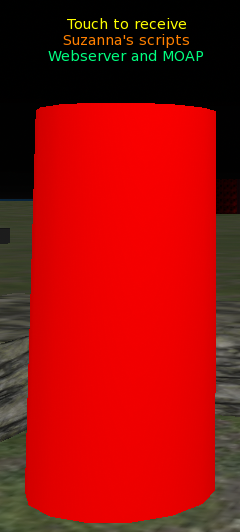

## Web server and MOAP - Part I (Basics)

The objects with these scripts are available at [SLua Yardang 178,2,23 (SLua Class Study Area)](secondlife://Aditi/secondlife/SLua%20Yardang/178/2/23):

You are welcome to the Study Groups all Saturdays from 11AM to 1PM SLT with your questions, practices, and projects to chat about this and anything else scripting related.

### Media viewer

Displays an external webpage using Media-on-a-prim.

Say the link to the webpage in public chat, starting with "http".

<h4>Media viewer</h4>
<pre class="language-sluab line-numbers"><code class="language-sluab">-- Media viewer

local FACE_MEDIA = 2

local function show(url)
    ll.SetPrimMediaParams(FACE_MEDIA, {
        PRIM_MEDIA_CURRENT_URL, url,
        PRIM_MEDIA_HOME_URL, url,
        PRIM_MEDIA_AUTO_ZOOM, false,
        PRIM_MEDIA_FIRST_CLICK_INTERACT, true,
        PRIM_MEDIA_PERMS_INTERACT, PRIM_MEDIA_PERM_ANYONE,
        PRIM_MEDIA_PERMS_CONTROL, PRIM_MEDIA_PERM_NONE,
        PRIM_MEDIA_AUTO_PLAY, true
    })
end

local function initialize()
    ll.Listen(0, "", "", "")
end

LLEvents:on("listen", function(channel, name, id, message)
    if channel == 0 then
        if message:sub(1,7) == "http://" or message:sub(1,8) == "https://" then
            show(message)
        end
    end
end)

initialize()</code></pre>

### URL with HTML

We can set HTML code to the media face, adding "data:text/html," in front of the html code when we set the url. No headers, only the html that would go inside the <body>.

The maximum length of this "url" is 1024 characters.

<h4>URL with HTMLHTML</h4>

The html string would usually be between quotes, I'm using [=[ to identify it as html for the syntax highlighter

-- using HTML in the URL

local DATA_URL = "data:text/html,"
local FACE_MEDIA = 2

local html = [=[<h1>Welcome to My Page!</h1>
Hello, world! Isn't HTML amazing?

HTML stands for <strong>Hyper Text Markup Language</strong>.

Thanks for visiting! Have a <em>fantastic</em> day!
]=]

local function show(url)
    ll.SetPrimMediaParams(FACE_MEDIA, {
        PRIM_MEDIA_CURRENT_URL, url,
        PRIM_MEDIA_HOME_URL, url,
        PRIM_MEDIA_AUTO_ZOOM, false,
        PRIM_MEDIA_FIRST_CLICK_INTERACT, true,
        PRIM_MEDIA_PERMS_INTERACT, PRIM_MEDIA_PERM_ANYONE,
        PRIM_MEDIA_PERMS_CONTROL, PRIM_MEDIA_PERM_NONE,
        PRIM_MEDIA_AUTO_PLAY, true,
        PRIM_MEDIA_WIDTH_PIXELS, 512,
        PRIM_MEDIA_HEIGHT_PIXELS, 256
    })
end

show(DATA_URL .. html)

<pre class="language-sluab line-numbers"><code class="language-sluab">{{ slua | escape }}</code></pre>

### Displaying a notecard on MOAP

Uses an in-world URL and XHTML code to serve a page from the script.

URL's are assigned to the script and stop working when the script is reset or its object derezed or the region restarts.

We use XHTML because pages served as HTML are only visible to the owner of the object, to other people or opening the link in a web browser shows the HTML code.

<h4>Notecard displayHTML</h4>

Names between @...@ in the XHTML are to be replaced with generated XHTML code before serving the page

-- Notecard display

local FACE_MEDIA = 2

local url = ""

local htmlNotecard = [=[
<!DOCTYPE html PUBLIC "-//W3C//DTD XHTML 1.1//EN" "http://www.w3.org/TR/xhtml11/DTD/xhtml11.dtd">
<html xmlns="http://www.w3.org/1999/xhtml" lang="en" xml:lang="en">
<head>
  <meta http-equiv="Content-Type" content="text/html; charset=UTF-8" />
  <title>@NOTECARD_NAME@</title>
</head>
<body>
  <h1>@NOTECARD_NAME@</h1>
  @NOTECARD_LINES@
</body>
</html>
]=]

local htmlNotecardLines = [=[
  
@NOTECARD_LINE@

]=]

local notecardName = ""
local notecardLine = 1
local requestLineId = NULL_KEY
local notecard = {}

local function show(url)
    ll.SetPrimMediaParams(FACE_MEDIA, {
        PRIM_MEDIA_CURRENT_URL, url,
        PRIM_MEDIA_HOME_URL, url,
        PRIM_MEDIA_AUTO_ZOOM, false,
        PRIM_MEDIA_FIRST_CLICK_INTERACT, true,
        PRIM_MEDIA_PERMS_INTERACT, PRIM_MEDIA_PERM_ANYONE,
        PRIM_MEDIA_PERMS_CONTROL, PRIM_MEDIA_PERM_NONE,
        PRIM_MEDIA_AUTO_PLAY, true
    })
end

local function sayUrl(url)
    ll.OwnerSay(url)
end

local function initialize()
    notecardName = ll.GetInventoryName(INVENTORY_NOTECARD, 1)
    if notecardName ~= "" then
        notecard = {}
        notecardLine = 1
        requestLineId = ll.GetNotecardLine(notecardName, notecardLine)
    else
        ll.OwnerSay("No notecards in the contents")
    end
end

LLEvents:on("dataserver", function(request, data)
    if request == requestLineId then
        repeat
            if data ~= EOF then
                table.insert(notecard, ll.ReplaceSubString(htmlNotecardLines, "@NOTECARD_LINE@", data, 0))
                notecardLine += 1
                data = ll.GetNotecardLineSync(notecardName, notecardLine)
                if data == NAK then
                    requestLineId = ll.GetNotecardLine(notecardName, notecardLine)
                end
            end
        until data == EOF or data == NAK
        if data == EOF then
            ll.RequestURL()
        end
    end
end)

LLEvents:on("http_request", function(id, method, body)
    if method == URL_REQUEST_GRANTED then
        url = body
        sayUrl(url)
        show(url)
    elseif method == URL_REQUEST_DENIED then
        ll.OwnerSay("Unable to get URL!")
    elseif method == "GET" then
        local html = ll.ReplaceSubString(htmlNotecard, "@NOTECARD_NAME@", notecardName, 0)
        html = ll.ReplaceSubString(html, "@NOTECARD_LINES@", table.concat(notecard), 0)
        ll.SetContentType(id, CONTENT_TYPE_XHTML)
        ll.HTTPResponse(id, 200, html)
    end
end)

LLEvents:on("on_rez", function(start_param)
    ll.ResetScript()
end)

LLEvents:on("changed", function(change)
    if bit32.btest(change, bit32.bor(CHANGED_REGION_START, CHANGED_OWNER, CHANGED_INVENTORY)) then
        ll.ResetScript()
    end
end)

initialize()
<pre class="language-sluab line-numbers"><code class="language-sluab">{{ slua | escape }}</code></pre>

### Displaying random quotes in single or multi view

The pages are not rendered by the server. They are rendered by our local viewer (Firestorm, etc).

When the script sets an url with llSetPrimMediaParams(), the server stores this url, as part of the object, in the info of the face of the object.  
The server does nothing else with the url, only storing it. It doesn't use the url, it doesn't make the request, anything.  
It's our local viewer that requests the url and displays the answer.  

When the media object comes into our view, our local viewer receives all the info of the object, including the media url, from the server.  
Our local viewer opens its internal web browser, and embeds it in the face showing the media. The viewer requests the url and the viewer's web browser displays the media on the face of the object.  
Each face with media needs its own web browser instance.

In the script, when we use an in-world URL, its http_request is triggered once for each avatar looking at it. If nobody is looking http_request is not be triggered.

The next scripts request a new random quote from an external server at owner's touch. The first script shows the same quote to everyone, the second one shows a different quote to each viewer or internal/external browser using the link.

<h4>Random quotes: single viewHTML</h4>

Requesting the quote on touch, serving the same one

It adds a time to the media URL that is not used, but we need to set a different URL to make it reload

-- Random quotes (single view)

local url = ""

local htmlQuote = [=[
<!DOCTYPE html PUBLIC "-//W3C//DTD XHTML 1.1//EN" "http://www.w3.org/TR/xhtml11/DTD/xhtml11.dtd">
<html xmlns="http://www.w3.org/1999/xhtml" lang="en" xml:lang="en">
<head>
  <meta http-equiv="Content-Type" content="text/html; charset=UTF-8" />
  <title>Quote of the Moment</title>
</head>
<body>
  <h1 style="color: green;">@QUOTE@</h1>
  <h1 style="color: green;">@AUTHOR@</h1>
</body>
</html>
]=]

local WEB_API = "https://zenquotes.io/api/random"
local FACE_MEDIA = 2

local httpRequestId = NULL_KEY
local html = ""
local requestCount = 0

local function show(url)
    ll.SetPrimMediaParams(FACE_MEDIA, {
        PRIM_MEDIA_CURRENT_URL, url,
        PRIM_MEDIA_HOME_URL, url,
        PRIM_MEDIA_AUTO_ZOOM, false,
        PRIM_MEDIA_FIRST_CLICK_INTERACT, true,
        PRIM_MEDIA_PERMS_INTERACT, PRIM_MEDIA_PERM_ANYONE,
        PRIM_MEDIA_PERMS_CONTROL, PRIM_MEDIA_PERM_NONE,
        PRIM_MEDIA_AUTO_PLAY, true,
        PRIM_MEDIA_WIDTH_PIXELS, 1024,
        PRIM_MEDIA_HEIGHT_PIXELS, 256
    })
end

local function initialize()
    ll.ClearPrimMedia(FACE_MEDIA)
    requestCount = 0
    ll.RequestURL()
end

LLEvents:on("touch_start", function(events)
    if events[1]:getKey() == ll.GetOwner() then
        if requestCount ~= 0 then
            ll.OwnerSay(`{requestCount} requests to the previous page`)
            requestCount = 0
        end
        httpRequestId = ll.HTTPRequest(WEB_API, {}, "")
    end
end)

LLEvents:on("http_response", function(request_id, status, metadata, body)
    if httpRequestId == request_id then
        local json = lljson.decode(body)
        html = ll.ReplaceSubString(htmlQuote, "@QUOTE@", json[1].q, 0)
        html = ll.ReplaceSubString(html, "@AUTHOR@", json[1].a, 0)
        show(`{url}/?time={os.time()}`)
    end
end)

LLEvents:on("http_request", function(id, method, body)
    if method == URL_REQUEST_GRANTED then
        url = body
        ll.OwnerSay(url)
        httpRequestId = ll.HTTPRequest(WEB_API, {}, "")
    elseif method == URL_REQUEST_DENIED then
        ll.OwnerSay("Unable to get URL!")
    elseif method == "GET" then
        ll.SetContentType(id, CONTENT_TYPE_XHTML)
        ll.HTTPResponse(id, 200, html)
        requestCount += 1
    end
end)

LLEvents:on("on_rez", function(start_param)
    ll.ResetScript()
end)

LLEvents:on("changed", function(change)
    if bit32.btest(change, bit32.bor(CHANGED_REGION_START, CHANGED_OWNER, CHANGED_INVENTORY)) then
        ll.ResetScript()
    end
end)

initialize()
<pre class="language-sluab line-numbers"><code class="language-sluab">{{ slua | escape }}</code></pre>

<h4>Random quotes: multi viewHTML</h4>

Requesting the quote on request, serving different ones

-- Random quotes (multi view)

local url = ""

local htmlQuote = [=[
<!DOCTYPE html PUBLIC "-//W3C//DTD XHTML 1.1//EN" "http://www.w3.org/TR/xhtml11/DTD/xhtml11.dtd">
<html xmlns="http://www.w3.org/1999/xhtml" lang="en" xml:lang="en">
<head>
  <meta http-equiv="Content-Type" content="text/html; charset=UTF-8" />
  <title>Quote of the Moment</title>
</head>
<body>
  <h1 style="color: blue;">@QUOTE@</h1>
  <h1 style="color: blue;">@AUTHOR@</h1>
</body>
</html>
]=]

local WEB_API = "https://zenquotes.io/api/random"
local FACE_MEDIA = 2

local requests = {}
local requestCount = 0

local function show(url)
    ll.SetPrimMediaParams(FACE_MEDIA, {
        PRIM_MEDIA_CURRENT_URL, url,
        PRIM_MEDIA_HOME_URL, url,
        PRIM_MEDIA_AUTO_ZOOM, false,
        PRIM_MEDIA_FIRST_CLICK_INTERACT, true,
        PRIM_MEDIA_PERMS_INTERACT, PRIM_MEDIA_PERM_ANYONE,
        PRIM_MEDIA_PERMS_CONTROL, PRIM_MEDIA_PERM_NONE,
        PRIM_MEDIA_AUTO_PLAY, true,
        PRIM_MEDIA_WIDTH_PIXELS, 1024,
        PRIM_MEDIA_HEIGHT_PIXELS, 256
    })
end

local function initialize()
    ll.ClearPrimMedia(FACE_MEDIA)
    requests = {}
    requestCount = 0
    ll.RequestURL()
end

LLEvents:on("touch_start", function(events)
    if events[1]:getKey() == ll.GetOwner() then
        requests = {}
        if requestCount ~= 0 then
            ll.OwnerSay(`{requestCount} requests to the previous page`)
            requestCount = 0
        end
        show(`{url}/?time={os.time()}`)
    end
end)

LLEvents:on("http_response", function(request_id, status, metadata, body)
    if requests[request_id] then
        local id = requests[request_id]
        local json = lljson.decode(body)
        local html = ll.ReplaceSubString(htmlQuote, "@QUOTE@", json[1].q, 0)
        html = ll.ReplaceSubString(html, "@AUTHOR@", json[1].a, 0)
        ll.SetContentType(id, CONTENT_TYPE_XHTML)
        ll.HTTPResponse(id, 200, html)
        requests[request_id] = nil
    end
end)

LLEvents:on("http_request", function(id, method, body)
    if method == URL_REQUEST_GRANTED then
        url = body
        ll.OwnerSay(url)
    elseif method == URL_REQUEST_DENIED then
        ll.OwnerSay("Unable to get URL!")
    elseif method == "GET" then
        requests[ll.HTTPRequest(WEB_API, {}, "")] = id
        requestCount += 1
    end
end)

LLEvents:on("on_rez", function(start_param)
    ll.ResetScript()
end)

LLEvents:on("changed", function(change)
    if bit32.btest(change, bit32.bor(CHANGED_REGION_START, CHANGED_OWNER, CHANGED_INVENTORY)) then
        ll.ResetScript()
    end
end)

initialize()
<pre class="language-sluab line-numbers"><code class="language-sluab">{{ slua | escape }}</code></pre>

### List of Visitors

Four scripts showing a list of the visitors in the region with progressive improvements:
- HTML only, no styling (looks ugly).
- HTML and CSS styling.
- Multipage single view (index, visitors and language) using links. When a page is changed, it changes in all the viewers.
- Multipage multi view using buttons. Viewers have independent navigation, each one can be in a different page.

<h4>List of visitors, single page, no stylingHTML</h4>
-- List of visitors, single page, no styling

local FACE_MEDIA = 2

local url = ""

local htmlVisitorsList = [=[
<!DOCTYPE html PUBLIC "-//W3C//DTD XHTML 1.1//EN" "http://www.w3.org/TR/xhtml11/DTD/xhtml11.dtd">
<html xmlns="http://www.w3.org/1999/xhtml" lang="en" xml:lang="en">
<head>
  <meta http-equiv="Content-Type" content="text/html; charset=UTF-8" />
  <title>Table of Visitors</title>
</head>
<body>
  <h1>Table of Visitors</h1>
  <table border="1">
    <thead>
      <tr>
        <th>Name</th>
        <th>Username</th>
      </tr>
    </thead>
    <tfoot>
      <tr>
        <td colspan="2">Total Visitors: @TOTAL_VISITORS@</td>
      </tr>
    </tfoot>
    <tbody>
      @TABLE@
    </tbody>
  </table>
</body>
</html>
]=]

local htmlVisitorsListTable = [=[
      <tr>
        <td>@NAME@</td>
        <td>@USERNAME@</td>
      </tr>
]=]

local function show(url)
    ll.SetPrimMediaParams(FACE_MEDIA, {
        PRIM_MEDIA_CURRENT_URL, url,
        PRIM_MEDIA_HOME_URL, url,
        PRIM_MEDIA_AUTO_ZOOM, false,
        PRIM_MEDIA_FIRST_CLICK_INTERACT, true,
        PRIM_MEDIA_PERMS_INTERACT, PRIM_MEDIA_PERM_ANYONE,
        PRIM_MEDIA_PERMS_CONTROL, PRIM_MEDIA_PERM_NONE,
        PRIM_MEDIA_AUTO_PLAY, true
    })
end

local function sayUrl(url)
    ll.OwnerSay(url)
end

local function tableVisitors(html)
    local rows = {}
    local visitors = ll.GetAgentList(AGENT_LIST_REGION, {})
    for _, visitor in visitors do
        local row = htmlVisitorsListTable
        row = ll.ReplaceSubString(row, "@NAME@", ll.GetDisplayName(visitor), 0)
        row = ll.ReplaceSubString(row, "@USERNAME@", ll.GetUsername(visitor), 0)
        table.insert(rows, row)
    end
    html = ll.ReplaceSubString(html, "@TOTAL_VISITORS@", tostring(#visitors), 0)
    html = ll.ReplaceSubString(html, "@TABLE@", table.concat(rows), 0)
    return html
end

local function initialize()
    ll.RequestURL()
end

LLEvents:on("http_request", function(id, method, body)
    if method == URL_REQUEST_GRANTED then
        url = body
        sayUrl(url)
        show(url)
    elseif method == URL_REQUEST_DENIED then
        ll.OwnerSay("Unable to get URL!")
    elseif method == "GET" then
        local html = tableVisitors(htmlVisitorsList)
        ll.SetContentType(id, CONTENT_TYPE_XHTML)
        ll.HTTPResponse(id, 200, html)
    end
end)

LLEvents:on("on_rez", function(start_param)
    ll.ResetScript()
end)

LLEvents:on("changed", function(change)
    if bit32.btest(change, bit32.bor(CHANGED_REGION_START, CHANGED_OWNER, CHANGED_INVENTORY)) then
        ll.ResetScript()
    end
end)

initialize()
<pre class="language-sluab line-numbers"><code class="language-sluab">{{ slua | escape }}</code></pre>

<h4>List of visitors, single page, CSS stylingHTMLCSS</h4>
-- List of visitors, single page, CSS styling

local FACE_MEDIA = 2

local url = ""

local htmlVisitorsList = [=[
<!DOCTYPE html PUBLIC "-//W3C//DTD XHTML 1.1//EN" "http://www.w3.org/TR/xhtml11/DTD/xhtml11.dtd">
<html xmlns="http://www.w3.org/1999/xhtml" lang="en" xml:lang="en">
<head>
  <meta http-equiv="Content-Type" content="text/html; charset=UTF-8" />
  <title>Table of Visitors</title>
  
</head>
<body>
  <h1>Table of Visitors</h1>
  <table>
    <thead>
      <tr>
        <th>Name</th>
        <th>Username</th>
      </tr>
    </thead>
    <tfoot>
      <tr>
        <td colspan="2">Total Visitors: @TOTAL_VISITORS@</td>
      </tr>
    </tfoot>
    <tbody>
      @TABLE@
    </tbody>
  </table>
</body>
</html>
]=]

local htmlVisitorsListTable = [=[
      <tr>
        <td>@NAME@</td>
        <td>@USERNAME@</td>
      </tr>
]=]

local function show(url)
    ll.SetPrimMediaParams(FACE_MEDIA, {
        PRIM_MEDIA_CURRENT_URL, url,
        PRIM_MEDIA_HOME_URL, url,
        PRIM_MEDIA_AUTO_ZOOM, false,
        PRIM_MEDIA_FIRST_CLICK_INTERACT, true,
        PRIM_MEDIA_PERMS_INTERACT, PRIM_MEDIA_PERM_ANYONE,
        PRIM_MEDIA_PERMS_CONTROL, PRIM_MEDIA_PERM_NONE,
        PRIM_MEDIA_AUTO_PLAY, true
    })
end

local function tableVisitors(html)
    local rows = {}
    local visitors = ll.GetAgentList(AGENT_LIST_REGION, {})
    for _, visitor in visitors do
        local row = htmlVisitorsListTable
        row = ll.ReplaceSubString(row, "@NAME@", ll.GetDisplayName(visitor), 0)
        row = ll.ReplaceSubString(row, "@USERNAME@", ll.GetUsername(visitor), 0)
        table.insert(rows, row)
    end
    html = ll.ReplaceSubString(html, "@TOTAL_VISITORS@", tostring(#visitors), 0)
    html = ll.ReplaceSubString(html, "@TABLE@", table.concat(rows), 0)
    return html
end

local function initialize()
    ll.RequestURL()
end

LLEvents:on("http_request", function(id, method, body)
    if method == URL_REQUEST_GRANTED then
        url = body
        ll.OwnerSay(url)
        show(url)
    elseif method == URL_REQUEST_DENIED then
        ll.OwnerSay("Unable to get URL!")
    elseif method == "GET" then
        local html = tableVisitors(htmlVisitorsList)
        ll.SetContentType(id, CONTENT_TYPE_XHTML)
        ll.HTTPResponse(id, 200, html)
    end
end)

LLEvents:on("on_rez", function(start_param)
    ll.ResetScript()
end)

LLEvents:on("changed" function(change)
    if bit32.btest(change, bit32.bor(CHANGED_REGION_START, CHANGED_OWNER, CHANGED_INVENTORY)) then
        ll.ResetScript()
    end
end)

initialize()
<pre class="language-sluab line-numbers"><code class="language-sluab">{{ slua | escape }}</code></pre>

<h4>List of visitors, multipage, single view, CSS stylingHTMLCSS</h4>

Links send GET requests and change the media URL

-- List of visitors, multipage, single view, CSS styling

local FACE_MEDIA = 2

local url = ""

local htmlHeader = [=[
<!DOCTYPE html PUBLIC "-//W3C//DTD XHTML 1.1//EN" "http://www.w3.org/TR/xhtml11/DTD/xhtml11.dtd">
<html xmlns="http://www.w3.org/1999/xhtml" lang="en" xml:lang="en">
<head>
  <meta http-equiv="Content-Type" content="text/html; charset=UTF-8" />
  <title>@TITLE@</title>
  @STYLE@
</head>
<body>
  @BODY@
</body>
</html>
]=]

local htmlStyle = [=[
  
]=]

local htmlLinks = [=[
  <h1>Links Page</h1>
  <ul>
    <li><a href="visitors" title="Go to the visitors list">Visitors</a></li>
    <li><a href="languages" title="Go to the languages list">Languages</a></li>
  </ul>
]=]

local htmlLinksTitle = "Links Page"

local htmlVisitors = [=[
  <h1>Table of Visitors</h1>
  <table>
    <thead>
      <tr>
        <th>Name</th>
        <th>Username</th>
      </tr>
    </thead>
    <tfoot>
      <tr>
        <td colspan="2">Total Visitors: @TOTAL_VISITORS@</td>
      </tr>
    </tfoot>
    <tbody>
      @TABLE@
    </tbody>
  </table>
  <a href="links" title="Go back to the links page">Back</a>
]=]

local htmlVisitorsTable = [=[
      <tr>
        <td>@NAME@</td>
        <td>@USERNAME@</td>
      </tr>
]=]

local htmlVisitorsTitle = "Table of Visitors"

local htmlLanguages = [=[
  <h1>Table of Languages</h1>
  <table>
    <thead>
      <tr>
        <th>Language</th>
        <th>Visitors</th>
      </tr>
    </thead>
    <tfoot>
      <tr>
        <td colspan="2">Total Languages: @TOTAL_LANGUAGES@</td>
      </tr>
    </tfoot>
    <tbody>
      @TABLE@
    </tbody>
  </table>
  <a href="links" title="Go back to the links page">Back</a>
]=]

local htmlLanguagesTable = [=[
      <tr>
        <td>@LANGUAGE@</td>
        <td>@VISITORS@</td>
      </tr>
]=]

local htmlLanguagesTitle = "Table of Languages"

local function show(url)
    ll.SetPrimMediaParams(FACE_MEDIA, {
        PRIM_MEDIA_CURRENT_URL, url,
        PRIM_MEDIA_HOME_URL, url,
        PRIM_MEDIA_AUTO_ZOOM, false,
        PRIM_MEDIA_FIRST_CLICK_INTERACT, true,
        PRIM_MEDIA_PERMS_INTERACT, PRIM_MEDIA_PERM_OWNER,
        PRIM_MEDIA_PERMS_CONTROL, PRIM_MEDIA_PERM_NONE,
        PRIM_MEDIA_AUTO_PLAY, true
    })
end

local function tableVisitors(html)
    local rows = {}
    local visitors = ll.GetAgentList(AGENT_LIST_REGION, {})
    for _, visitor in visitors do
        local row = htmlVisitorsTable
        row = ll.ReplaceSubString(row, "@NAME@", ll.GetDisplayName(visitor), 0)
        row = ll.ReplaceSubString(row, "@USERNAME@", ll.GetUsername(visitor), 0)
        table.insert(rows, row)
    end
    html = ll.ReplaceSubString(html, "@TOTAL_VISITORS@", tostring(#visitors), 0)
    html = ll.ReplaceSubString(html, "@TABLE@", table.concat(rows), 0)
    return html
end

local LANGUAGES = {
    en = "English",   da = "Danish",  de = "German",   es = "Spanish",    fr = "French",  it = "Italian",
    hu = "Hungarian", nl = "Dutch",   pl = "Polish",   pt = "Portuguese", ru = "Russian", tr = "Turkish",
    uk = "Ukrainian", zh = "Chinese", ja = "Japanese", ko = "Korean",     [""] = "unknown"
}

local function tableLanguages(html)
    local languages = {}
    local visitors = ll.GetAgentList(AGENT_LIST_REGION, {})
    for _, visitor in visitors do
        local language = ll.GetAgentLanguage(visitor)
        languages[language] = (languages[language] or 0) + 1
    end
    local lang = {}
    for code, count in languages do
        table.insert(lang, {code = code, count = count})
    end
    table.sort(lang, function(a, b)
        return if a.count ~= b.count then
            a.count > b.count
        else
            a.code < b.code
    end)
    local rows = {}
    for _, language in lang do
        local languageName = LANGUAGES[language.code] or language.code
        local row = htmlLanguagesTable
        row = ll.ReplaceSubString(row, "@LANGUAGE@", languageName, 0)
        row = ll.ReplaceSubString(row, "@VISITORS@", tostring(language.count), 0)
        table.insert(rows, row)
    end
    html = ll.ReplaceSubString(html, "@TOTAL_LANGUAGES@", tostring(#lang - if languages[""] then 1 else 0), 0)
    html = ll.ReplaceSubString(html, "@TABLE@", table.concat(rows), 0)
    return html
end

local function initialize()
    ll.RequestURL()
end

LLEvents:on("http_request", function(id, method, body)
    if method == URL_REQUEST_GRANTED then
        url = body .. "/links"
        ll.OwnerSay(url)
        show(url)
    elseif method == URL_REQUEST_DENIED then
        ll.OwnerSay("Unable to get URL!")
    elseif method == "GET" then
        local path = ll.ToLower(ll.GetHTTPHeader(id, "x-path-info"))
        local query = ll.ToLower(ll.GetHTTPHeader(id, "x-query-string"))
        local html = ll.ReplaceSubString(htmlHeader, "@STYLE@", htmlStyle, 0)
        if path == "/links" then
            html = ll.ReplaceSubString(html, "@TITLE@", htmlLinksTitle, 0)
            html = ll.ReplaceSubString(html, "@BODY@", htmlLinks, 0)
        elseif path == "/visitors" then
            html = ll.ReplaceSubString(html, "@TITLE@", htmlVisitorsTitle, 0)
            html = ll.ReplaceSubString(html, "@BODY@", tableVisitors(htmlVisitors), 0)
        elseif path == "/languages" then
            html = ll.ReplaceSubString(html, "@TITLE@", htmlLanguagesTitle, 0)
            html = ll.ReplaceSubString(html, "@BODY@", tableLanguages(htmlLanguages), 0)
        end
        ll.SetContentType(id, CONTENT_TYPE_XHTML)
        ll.HTTPResponse(id, 200, html)
    end
end)

LLEvents:on("on_rez", function(start_param)
    ll.ResetScript()
end)

LLEvents:on("changed", function(change)
    if bit32.btest(change, bit32.bor(CHANGED_REGION_START, CHANGED_OWNER, CHANGED_INVENTORY)) then
        ll.ResetScript()
    end
end)

initialize()
<pre class="language-sluab line-numbers"><code class="language-sluab">{{ slua | escape }}</code></pre>

<h4>List of visitors, multipage, multi view, CSS stylingHTMLCSS</h4>

Buttons in forms with method="POST" and action="" show the page returned to the request and don't change the media URL

-- List of visitors, multipage, multi view, CSS styling

local FACE_MEDIA = 2

local url = ""

local htmlHeader = [=[
<!DOCTYPE html PUBLIC "-//W3C//DTD XHTML 1.1//EN" "http://www.w3.org/TR/xhtml11/DTD/xhtml11.dtd">
<html xmlns="http://www.w3.org/1999/xhtml" lang="en" xml:lang="en">
<head>
  <meta http-equiv="Content-Type" content="text/html; charset=UTF-8" />
  <title>@TITLE@</title>
  @STYLE@
</head>
<body>
  @BODY@
</body>
</html>
]=]

local htmlStyle = [=[
  
]=]

local htmlLinks = [=[
  <h1>Links Page</h1>
  <form action="" method="POST">
    <button type="submit" name="button" value="visitors" title="Go to the visitors list">Visitors</button>
  </form>
  <form action="" method="POST">
    <button type="submit" name="button" value="languages" title="Go to the languages list">Languages</button>
  </form>
]=]

local htmlLinksTitle = "Links Page"

local htmlVisitors = [=[
  <h1>Table of Visitors</h1>
  <table>
    <thead>
      <tr>
        <th>Name</th>
        <th>Username</th>
      </tr>
    </thead>
    <tfoot>
      <tr>
        <td colspan="2">Total Visitors: @TOTAL_VISITORS@</td>
      </tr>
    </tfoot>
    <tbody>
      @TABLE@
    </tbody>
  </table>
  <form action="" method="POST">
    <button type="submit" name="button" value="links" title="Go back to the links page">Back</button>
  </form>
]=]

local htmlVisitorsTable = [=[
      <tr>
        <td>@NAME@</td>
        <td>@USERNAME@</td>
      </tr>
]=]

local htmlVisitorsTitle = "Table of Visitors"

local htmlLanguages = [=[
  <h1>Table of Languages</h1>
  <table>
    <thead>
      <tr>
        <th>Language</th>
        <th>Visitors</th>
      </tr>
    </thead>
    <tfoot>
      <tr>
        <td colspan="2">Total Languages: @TOTAL_LANGUAGES@</td>
      </tr>
    </tfoot>
    <tbody>
      @TABLE@
    </tbody>
  </table>
  <form action="" method="POST">
    <button type="submit" name="button" value="links" title="Go back to the links page">Back</button>
  </form>
]=]

local htmlLanguagesTable = [=[
      <tr>
        <td>@LANGUAGE@</td>
        <td>@VISITORS@</td>
      </tr>
]=]

local htmlLanguagesTitle = "Table of Languages"

local function show(url)
    ll.SetPrimMediaParams(FACE_MEDIA, {
        PRIM_MEDIA_CURRENT_URL, url,
        PRIM_MEDIA_HOME_URL, url,
        PRIM_MEDIA_AUTO_ZOOM, false,
        PRIM_MEDIA_FIRST_CLICK_INTERACT, true,
        PRIM_MEDIA_PERMS_INTERACT, PRIM_MEDIA_PERM_ANYONE,
        PRIM_MEDIA_PERMS_CONTROL, PRIM_MEDIA_PERM_NONE,
        PRIM_MEDIA_AUTO_PLAY, true
    })
end

local function parseQuery(query)
    local params = {}
    for key, value in query:gmatch("([^&=]+)=?([^&]*)") do
        params[ll.UnescapeURL(key)] = ll.UnescapeURL((value:gsub("+"," ")))
    end
    return params
end

local function tableVisitors(html)
    local rows = {}
    local visitors = ll.GetAgentList(AGENT_LIST_REGION, {})
    for _, visitor in visitors do
        local row = htmlVisitorsTable
        row = ll.ReplaceSubString(row, "@NAME@", ll.GetDisplayName(visitor), 0)
        row = ll.ReplaceSubString(row, "@USERNAME@", ll.GetUsername(visitor), 0)
        table.insert(rows, row)
    end
    html = ll.ReplaceSubString(html, "@TOTAL_VISITORS@", tostring(#visitors), 0)
    html = ll.ReplaceSubString(html, "@TABLE@", table.concat(rows), 0)
    return html
end

local LANGUAGES = {
    en = "English",   da = "Danish",  de = "German",   es = "Spanish",    fr = "French",  it = "Italian",
    hu = "Hungarian", nl = "Dutch",   pl = "Polish",   pt = "Portuguese", ru = "Russian", tr = "Turkish",
    uk = "Ukrainian", zh = "Chinese", ja = "Japanese", ko = "Korean",     [""] = "unknown"
}

local function tableLanguages(html)
    local languages = {}
    local visitors = ll.GetAgentList(AGENT_LIST_REGION, {})
    for _, visitor in visitors do
        local language = ll.GetAgentLanguage(visitor)
        languages[language] = (languages[language] or 0) + 1
    end
    local lang = {}
    for code, count in languages do
        table.insert(lang, {code = code, count = count})
    end
    table.sort(lang, function(a, b)
        return if a.count ~= b.count then
            a.count > b.count
        else
            a.code < b.code
    end)
    local rows = {}
    for _, language in lang do
        local languageName = LANGUAGES[language.code] or language.code
        local row = htmlLanguagesTable
        row = ll.ReplaceSubString(row, "@LANGUAGE@", languageName, 0)
        row = ll.ReplaceSubString(row, "@VISITORS@", tostring(language.count), 0)
        table.insert(rows, row)
    end
    html = ll.ReplaceSubString(html, "@TOTAL_LANGUAGES@", tostring(#lang - if languages[""] then 1 else 0), 0)
    html = ll.ReplaceSubString(html, "@TABLE@", table.concat(rows), 0)
    return html
end

local function responsePage(id, page)
    local html = ll.ReplaceSubString(htmlHeader, "@STYLE@", htmlStyle, 0)
    if page == "links" then
        html = ll.ReplaceSubString(html, "@TITLE@", htmlLinksTitle, 0)
        html = ll.ReplaceSubString(html, "@BODY@", htmlLinks, 0)
    elseif page == "visitors" then
        html = ll.ReplaceSubString(html, "@TITLE@", htmlVisitorsTitle, 0)
        html = ll.ReplaceSubString(html, "@BODY@", tableVisitors(htmlVisitors), 0)
    elseif page == "languages" then
        html = ll.ReplaceSubString(html, "@TITLE@", htmlLanguagesTitle, 0)
        html = ll.ReplaceSubString(html, "@BODY@", tableLanguages(htmlLanguages), 0)
    end
    ll.SetContentType(id, CONTENT_TYPE_XHTML)
    ll.HTTPResponse(id, 200, html)
end

local function initialize()
    ll.RequestURL()
end

LLEvents:on("http_request", function(id, method, body)
    if method == URL_REQUEST_GRANTED then
        url = body .. "/links"
        ll.OwnerSay(url)
        show(url)
    elseif method == URL_REQUEST_DENIED then
        ll.OwnerSay("Unable to get URL!")
    elseif method == "GET" then
        local path = ll.ToLower(ll.GetHTTPHeader(id, "x-path-info"))
        local query = ll.ToLower(ll.GetHTTPHeader(id, "x-query-string"))
        responsePage(id, path:sub(2))
    elseif method == "POST" then
        responsePage(id, parseQuery(body).button)
    end
end)

LLEvents:on("on_rez", function(start_param)
    ll.ResetScript()
end)

LLEvents:on("changed", function(change)
    if bit32.btest(change, bit32.bor(CHANGED_REGION_START, CHANGED_OWNER, CHANGED_INVENTORY)) then
        ll.ResetScript()
    end
end)

initialize()
<pre class="language-sluab line-numbers"><code class="language-sluab">{{ slua | escape }}</code></pre>

### Form Poll

Touches on a media face don't trigger touch events. The script can't know who is using the media.

The three scripts with a form to enter info use different user checks:

- The user enters the name, no user check.
- The user enters the username, the script opens a menu to the user to confirm.
- No MOAP, the script sends a link on touch (containing a random code) to open and fill in the browser.

<h4>Form Poll, no user checkHTMLCSS</h4>
-- Form Poll, no user check

local FACE_MEDIA = 2

local url = ""

local htmlHeader = [=[
<!DOCTYPE html PUBLIC "-//W3C//DTD XHTML 1.1//EN" "http://www.w3.org/TR/xhtml11/DTD/xhtml11.dtd">
<html xmlns="http://www.w3.org/1999/xhtml" lang="en" xml:lang="en">
<head>
  <meta http-equiv="Content-Type" content="text/html; charset=UTF-8" />
  <title>@TITLE@</title>
  @STYLE@
</head>
<body>
  @BODY@
</body>
</html>
]=]

local htmlStyle = [=[
  
]=]

local htmlFruits = [=[
  <form action="fruits" method="post">
    <h1>Select Your Favorite Fruit</h1>
    <label for="name">Your name:</label>
    <input type="text" id="name" name="name" />
    
Please select your favorite fruit:

      <input type="radio" id="apple" name="fruit" value="apple" />
      <label for="apple">Apple</label>
     
      <input type="radio" id="banana" name="fruit" value="banana" />
      <label for="banana">Banana</label>
     
      <input type="radio" id="orange" name="fruit" value="orange" />
      <label for="orange">Orange</label>
     
      <input type="radio" id="grape" name="fruit" value="grape" />
      <label for="grape">Grape</label>
      
    <input type="submit" value="Submit" />
  </form>
]=]

local htmlFruitsTitle = "Fruit Selection Form"

local function show(url)
    ll.SetPrimMediaParams(FACE_MEDIA, {
        PRIM_MEDIA_CURRENT_URL, url,
        PRIM_MEDIA_HOME_URL, url,
        PRIM_MEDIA_AUTO_ZOOM, false,
        PRIM_MEDIA_FIRST_CLICK_INTERACT, true,
        PRIM_MEDIA_PERMS_INTERACT, PRIM_MEDIA_PERM_ANYONE,
        PRIM_MEDIA_PERMS_CONTROL, PRIM_MEDIA_PERM_NONE,
        PRIM_MEDIA_AUTO_PLAY, true,
        PRIM_MEDIA_WIDTH_PIXELS, 512,
        PRIM_MEDIA_HEIGHT_PIXELS, 512
    })
end

local function getPage(path)
    local html = ""
    if path == "/fruits" then
        html = ll.ReplaceSubString(htmlHeader, "@STYLE@", htmlStyle, 0)
        html = ll.ReplaceSubString(html, "@TITLE@", htmlFruitsTitle, 0)
        html = ll.ReplaceSubString(html, "@BODY@", htmlFruits, 0)
    end
    return html
end

local function sayParams(params)
    local paramList = {}
    for key, value in params:gmatch("([^&=]+)=?([^&]*)") do
        table.insert(paramList, `{ll.UnescapeURL(key)}={ll.UnescapeURL((value:gsub("+"," ")))}`)
    end
    ll.Say(0, `Parameters: \n{table.concat(paramList, "\n")}`)
end

local function initialize()
    ll.RequestURL()
end

LLEvents:on("http_request", function(id, method, body)
    if method == URL_REQUEST_GRANTED then
        url = body .. "/fruits"
        ll.OwnerSay(url)
        show(url)
    elseif method == URL_REQUEST_DENIED then
        ll.OwnerSay("Unable to get URL!")
    elseif method == "GET" then
        local path = ll.ToLower(ll.GetHTTPHeader(id, "x-path-info"))
        local query = ll.ToLower(ll.GetHTTPHeader(id, "x-query-string"))
        ll.SetContentType(id, CONTENT_TYPE_XHTML)
        ll.HTTPResponse(id, 200, getPage(path))
    elseif method == "POST" then
        sayParams(body)
        local path = ll.ToLower(ll.GetHTTPHeader(id, "x-path-info"))
        ll.SetContentType(id, CONTENT_TYPE_XHTML)
        ll.HTTPResponse(id, 200, getPage(path))
    end
end)

LLEvents:on("on_rez", function(start_param)
    ll.ResetScript()
end)

LLEvents:on("changed", function(change)
    if bit32.btest(change, bit32.bor(CHANGED_REGION_START, CHANGED_OWNER, CHANGED_INVENTORY)) then
        ll.ResetScript()
    end
end)

initialize()
<pre class="language-sluab line-numbers"><code class="language-sluab">{{ slua | escape }}</code></pre>

<h4>Form Poll, user check with username and menuHTMLCSS</h4>
-- Form Poll, user check with username and menu

local FACE_MEDIA = 2

local url = ""

local htmlHeader = [=[
<!DOCTYPE html PUBLIC "-//W3C//DTD XHTML 1.1//EN" "http://www.w3.org/TR/xhtml11/DTD/xhtml11.dtd">
<html xmlns="http://www.w3.org/1999/xhtml" lang="en" xml:lang="en">
<head>
  <meta http-equiv="Content-Type" content="text/html; charset=UTF-8" />
  <title>@TITLE@</title>
  @STYLE@
</head>
<body>
  @BODY@
</body>
</html>
]=]

local htmlStyle = [=[
  
]=]

local htmlFruits = [=[
  <form action="fruits" method="post">
    <h1>Select Your Favorite Fruit</h1>
    <label for="name">Your username:</label>
    <input type="text" id="name" name="name" />
    
Please select your favorite fruit:

      <input type="radio" id="apple" name="fruit" value="apple" />
      <label for="apple">Apple</label>
     
      <input type="radio" id="banana" name="fruit" value="banana" />
      <label for="banana">Banana</label>
     
      <input type="radio" id="orange" name="fruit" value="orange" />
      <label for="orange">Orange</label>
     
      <input type="radio" id="grape" name="fruit" value="grape" />
      <label for="grape">Grape</label>
      
    <input type="submit" value="Submit" />
  </form>
]=]

local htmlFruitsTitle = "Fruit Selection Form"

local menuChannel = 0
local selection = {}

local function show(url)
    ll.SetPrimMediaParams(FACE_MEDIA, {
        PRIM_MEDIA_CURRENT_URL, url,
        PRIM_MEDIA_HOME_URL, url,
        PRIM_MEDIA_AUTO_ZOOM, false,
        PRIM_MEDIA_FIRST_CLICK_INTERACT, true,
        PRIM_MEDIA_PERMS_INTERACT, PRIM_MEDIA_PERM_ANYONE,
        PRIM_MEDIA_PERMS_CONTROL, PRIM_MEDIA_PERM_NONE,
        PRIM_MEDIA_AUTO_PLAY, true,
        PRIM_MEDIA_WIDTH_PIXELS, 512,
        PRIM_MEDIA_HEIGHT_PIXELS, 512
    })
end

local function getPage(path)
    local html = ""
    if path == "/fruits" then
        html = ll.ReplaceSubString(htmlHeader, "@STYLE@", htmlStyle, 0)
        html = ll.ReplaceSubString(html, "@TITLE@", htmlFruitsTitle, 0)
        html = ll.ReplaceSubString(html, "@BODY@", htmlFruits, 0)
    end
    return html
end

local function sayParams(userId, selFruit)
    ll.OwnerSay(`Parameters:\nname={ll.GetUsername(userId)}\nfruit={selFruit}`)
end

local function parseQuery(query)
    local params = {}
    for key, value in query:gmatch("([^&=]+)=?([^&]*)") do
        params[ll.UnescapeURL(key)] = ll.UnescapeURL((value:gsub("+"," ")))
    end
    return params
end

local function checkUser(params)
    local userId = ll.Name2Key(params.name)
    if userId.istruthy then
        local selFruit = params.fruit
        local message = "Poll Board\n\nPlease confirm that your selection of fruit is:\n" .. selFruit
        selection[userId] = selFruit
        ll.Dialog(userId, message, {"Yes", "No"}, menuChannel)
    end
end

local function initialize()
    menuChannel = bit32.bor(0x80000000, "0x" .. tostring(ll.GetKey()))
    ll.Listen(menuChannel, "", "", "")
    selection = {}
    ll.RequestURL()
end

LLEvents:on("listen", function(channel, name, id, message)
    if channel == menuChannel then
        if selection[id] then
            if message == "Yes" then
                sayParams(id, selection[id])
            end
            selection[id] = nil
        end
    end
end)

LLEvents:on("http_request·, function(id, method, body)
    if method == URL_REQUEST_GRANTED then
        url = body .. "/fruits"
        ll.OwnerSay(url)
        show(url)
    elseif method == URL_REQUEST_DENIED then
        ll.OwnerSay("Unable to get URL!")
    elseif method == "GET" then
        local path = ll.ToLower(ll.GetHTTPHeader(id, "x-path-info"))
        local query = ll.ToLower(ll.GetHTTPHeader(id, "x-query-string"))
        ll.SetContentType(id, CONTENT_TYPE_XHTML)
        ll.HTTPResponse(id, 200, getPage(path))
    elseif method == "POST" then
        checkUser(parseQuery(body))
        local path = ll.ToLower(ll.GetHTTPHeader(id, "x-path-info"))
        ll.SetContentType(id, CONTENT_TYPE_XHTML)
        ll.HTTPResponse(id, 200, getPage(path))
    end
end)

LLEvents:on("on_rez", function(start_param)
    ll.ResetScript()
end)

LLEvents:on("changed", function(change)
    if bit32.btest(change, bit32.bor(CHANGED_REGION_START, CHANGED_OWNER, CHANGED_INVENTORY)) then
        ll.ResetScript()
    end
end)

initialize()

<pre class="language-sluab line-numbers"><code class="language-sluab">{{ slua | escape }}</code></pre>

<h4>Form Poll, user check with code and browserHTMLCSS</h4>
-- Form Poll, user check with code and browser

local url = ""

local htmlHeader = [=[
<!DOCTYPE html PUBLIC "-//W3C//DTD XHTML 1.1//EN" "http://www.w3.org/TR/xhtml11/DTD/xhtml11.dtd">
<html xmlns="http://www.w3.org/1999/xhtml" lang="en" xml:lang="en">
<head>
  <meta http-equiv="Content-Type" content="text/html; charset=UTF-8" />
  <title>@TITLE@</title>
  @STYLE@
</head>
<body>
  @BODY@
</body>
</html>
]=]

local htmlStyle = [=[
  
]=]

local htmlFruits = [=[
  <form action="fruits" method="post">
    <h1>Select Your Favorite Fruit, @DISPLAY_NAME@</h1>
    
Please select your favorite fruit:

      <input type="radio" id="apple" name="fruit" value="apple" />
      <label for="apple">Apple</label>
     
      <input type="radio" id="banana" name="fruit" value="banana" />
      <label for="banana">Banana</label>
     
      <input type="radio" id="orange" name="fruit" value="orange" />
      <label for="orange">Orange</label>
     
      <input type="radio" id="grape" name="fruit" value="grape" />
      <label for="grape">Grape</label>
      
    <input type="hidden" name="userCode" value="@USER_CODE@" />
    <input type="submit" value="Submit" />
  </form>
]=]

local htmlFruitsTitle = "Fruit Selection Form"

local htmlThanks = [=[
  <h1>Fantastic selection of fruit, @DISPLAY_NAME@!</h1>
]=]

local htmlThanksTitle = "Thanks for your selection"

local userCodes = {}

local function getUserCode()
    local code = 0
    repeat
        code = math.random(1000000000)
    until not userCodes[code]
    return code
end

local function parseQuery(query)
    local params = {}
    for key, value in query:gmatch("([^&=]+)=?([^&]*)") do
        params[ll.UnescapeURL(key)] = ll.UnescapeURL((value:gsub("+"," ")))
    end
    return params
end

local function getPage(path, params)
    local html = ""
    local userCode = tonumber(params.userCode)
    if userCodes[userCode] then
        local displayName = userCodes[userCode].displayName
        html = ll.ReplaceSubString(htmlHeader, "@STYLE@", htmlStyle, 0)
        if path == "/fruits" then
            html = ll.ReplaceSubString(html, "@TITLE@", htmlFruitsTitle, 0)
            html = ll.ReplaceSubString(html, "@BODY@", htmlFruits, 0)
            html = ll.ReplaceSubString(html, "@USER_CODE@", tostring(userCode), 0)
        elseif path == "/thanks" then
            html = ll.ReplaceSubString(html, "@TITLE@", htmlThanksTitle, 0)
            html = ll.ReplaceSubString(html, "@BODY@", htmlThanks, 0)
        end
        html = ll.ReplaceSubString(html, "@DISPLAY_NAME@", displayName, 0)
    end
    return html
end

local function sayParams(params)
    local paramList = {}
    for key, value in params:gmatch("([^&=]+)=?([^&]*)") do
        table.insert(paramList, `{ll.UnescapeURL(key)}={ll.UnescapeURL((value:gsub("+"," ")))}`)
    end
    ll.OwnerSay(`Parameters: \n{table.concat(paramList, "\n")}`)
end

local function initialize()
    ll.SetText("Touch to select your favorite fruit", vector(1, 1, 1), 1)
    userCodes = {}
    ll.RequestURL()
end

LLEvents:on("touch_start", functoon(events)
    local userId = events[1]:getKey()
    local userCode = getUserCode()
    local displayName = ll.GetDisplayName(userId)
    userCodes[userCode] = { userId = userId, displayName = displayName }
    local urlParams = `{url}?userCode={userCode}`
    ll.RegionSayTo(userId, 0, urlParams)
    ll.LoadURL(userId, "please go to this link to select your fruit", urlParams)
end)

LLEvents:on("http_request", function(id, method, body)
    if method == URL_REQUEST_GRANTED then
        url = body .. "/fruits"
    elseif method == URL_REQUEST_DENIED then
        ll.OwnerSay("Unable to get URL!")
    elseif method == "GET" then
        local path = ll.ToLower(ll.GetHTTPHeader(id, "x-path-info"))
        local query = ll.GetHTTPHeader(id, "x-query-string")
        ll.SetContentType(id, CONTENT_TYPE_XHTML)
        ll.HTTPResponse(id, 200, getPage(path, parseQuery(query)))
    elseif method == "POST" then
        local userCode = tonumber(parseQuery(body).userCode)
        if userCodes[userCode] then
            local userInfo = userCodes[userCode]
            ll.OwnerSay(`User: {userInfo.userId} {userInfo.displayName}`)
            sayParams(body)
            ll.SetContentType(id, CONTENT_TYPE_XHTML)
            ll.HTTPResponse(id, 200, getPage("/thanks", parseQuery(body)))
            userCodes[userCode] = nil
        else
            ll.SetContentType(id, CONTENT_TYPE_XHTML)
            ll.HTTPResponse(id, 200, getPage("/fruits", parseQuery(body)))
        end
    end
end)

LLEvents:on("on_rez", function(start_param)
    ll.ResetScript()
end)

LLEvents:on("changed", function(change)
    if bit32.btest(change, bit32.bor(CHANGED_REGION_START, CHANGED_OWNER, CHANGED_INVENTORY)) then
        ll.ResetScript()
    end
end)

initialize()

<pre class="language-sluab line-numbers"><code class="language-sluab">{{ slua | escape }}</code></pre>

### Form Event

A script using most of the controls available in HTML Forms

<h4>Form Event with variety of controlsHTMLCSS</h4>
-- Form Event with variety of controls

local FACE_MEDIA = 2

local url = ""

local htmlHeader = [=[
<!DOCTYPE html PUBLIC "-//W3C//DTD XHTML 1.1//EN" "http://www.w3.org/TR/xhtml11/DTD/xhtml11.dtd">
<html xmlns="http://www.w3.org/1999/xhtml" lang="en" xml:lang="en">
<head>
  <meta http-equiv="Content-Type" content="text/html; charset=UTF-8" />
  <title>@TITLE@</title>
  @STYLE@
</head>
<body>
  @BODY@
</body>
</html>
]=]

local htmlStyle = [=[
  
]=]

local htmlEvents = [=[
  

    <h2>Event Registration Form</h2>
    <form action="events" method="post">
      <!-- Text Input -->
      

        <label for="eventName">Event Name:</label>
        <input type="text" id="eventName" name="eventName" required="required" />
      

      <!-- Email Input -->
      

        <label for="email">Contact Email:</label>
        <input type="email" id="email" name="email" />
      

      <!-- Password Input -->
      

        <label for="password">Password:</label>
        <input type="password" id="password" name="password" />
      

      <!-- Number Input -->
      

        <label for="attendees">Number of Attendees:</label>
        <input type="number" id="attendees" name="attendees" min="1" max="5000" />
      

      <!-- Date Input -->
      

        <label for="eventDate">Event Date:</label>
        <input type="date" id="eventDate" name="eventDate" />
      

      <!-- Time Input -->
      

        <label for="eventTime">Event Time:</label>
        <input type="time" id="eventTime" name="eventTime" />
      

      <!-- URL Input -->
      

        <label for="eventWebsite">Event Website:</label>
        <input type="url" id="eventWebsite" name="eventWebsite" />
      

      <!-- Telephone Input -->
      

        <label for="contactNumber">Contact Number:</label>
        <input type="tel" id="contactNumber" name="contactNumber" />
      

      <!-- File Input -->
      

        <label for="eventBanner">Event Banner:</label>
        <input type="file" id="eventBanner" name="eventBanner" />
      

      <!-- Radio Buttons -->
      

        <label>Event Type:</label>
        <input type="radio" id="online" name="eventType" value="Online" />
        <label for="online">Online</label>
        <input type="radio" id="offline" name="eventType" value="Offline" />
        <label for="offline">Offline</label>
      

      <!-- Checkbox -->
      

        <label>Additional Services:</label>
        <input type="checkbox" id="catering" name="services" value="Catering" />
        <label for="catering">Catering</label>
        <input type="checkbox" id="photography" name="services" value="Photography" />
        <label for="photography">Photography</label>
        <input type="checkbox" id="soundSystem" name="services" value="Sound System" />
        <label for="soundSystem">Sound System</label>
      

      <!-- Dropdown -->
      

        <label for="eventLocation">Event Location:</label>
        <select id="eventLocation" name="eventLocation">
          <option value="europe">Europe</option>
          <option value="america">America</option>
          <option value="asia">Asia</option>
          <option value="africa">Africa</option>
          <option value="oceania">Oceania</option>
        </select>
      

      <!-- Range Slider -->
      

        <label for="budget">Event Budget:</label>
        <input type="range" id="budget" name="budget" min="500" max="50000" step="500" value="5000" />
      

      <!-- Color Picker -->
      

        <label for="themeColor">Event Theme Color:</label>
        <input type="color" id="themeColor" name="themeColor" value="#ff5733" />
      

      <!-- Textarea -->
      

        <label for="eventDescription">Event Description:</label>
        <textarea id="eventDescription" name="eventDescription"></textarea>
      

      <!-- Submit Button -->
      

        <button type="submit">Register Event</button>
        <button type="reset">Reset Form</button>
      

    </form>
  

]=]

local htmlEventsTitle = "Event Registration Form"

local htmlThanks = [=[
  <h1>Thanks for registering the event</h1>
]=]

local htmlThanksTitle = "Thanks for your info"

local function show(url)
    ll.SetPrimMediaParams(FACE_MEDIA, {
        PRIM_MEDIA_CURRENT_URL, url,
        PRIM_MEDIA_HOME_URL, url,
        PRIM_MEDIA_AUTO_ZOOM, false,
        PRIM_MEDIA_FIRST_CLICK_INTERACT, true,
        PRIM_MEDIA_PERMS_INTERACT, PRIM_MEDIA_PERM_ANYONE,
        PRIM_MEDIA_PERMS_CONTROL, PRIM_MEDIA_PERM_NONE,
        PRIM_MEDIA_AUTO_PLAY, true
    })
end

local function getPage(path, params)
    local html = ll.ReplaceSubString(htmlHeader, "@STYLE@", htmlStyle, 0)
    if path == "/events" then
        html = ll.ReplaceSubString(html, "@TITLE@", htmlEventsTitle, 0)
        html = ll.ReplaceSubString(html, "@BODY@", htmlEvents, 0)
    elseif path == "/thanks" then
        html = ll.ReplaceSubString(html, "@TITLE@", htmlThanksTitle, 0)
        html = ll.ReplaceSubString(html, "@BODY@", htmlThanks, 0)
    end
    return html
end

local function sayParams(params)
    local paramList = {}
    for key, value in params:gmatch("([^&=]+)=?([^&]*)") do
        table.insert(paramList, `{ll.UnescapeURL(key)}={ll.UnescapeURL((value:gsub("+"," ")))}`)
    end
    ll.Say(0, `Parameters: \n{table.concat(paramList, "\n")}`)
end

local function initialize()
    ll.RequestURL()
end

LLEvents:on("http_request", function(id, method, body)
    if method == URL_REQUEST_GRANTED then
        url = body .. "/events"
        ll.Say(0, url)
        show(url)
    elseif method == URL_REQUEST_DENIED then
        ll.OwnerSay("Unable to get URL!")
    elseif method == "GET" then
        local path = ll.ToLower(ll.GetHTTPHeader(id, "x-path-info"))
        local query = ll.GetHTTPHeader(id, "x-query-string")
        ll.SetContentType(id, CONTENT_TYPE_XHTML)
        ll.HTTPResponse(id, 200, getPage(path, query))
    elseif method == "POST" then
        sayParams(body)
        local path = ll.ToLower(ll.GetHTTPHeader(id, "x-path-info"))
        ll.SetContentType(id, CONTENT_TYPE_XHTML)
        ll.HTTPResponse(id, 200, getPage("/thanks", body))
    end
end)

LLEvents:on("on_rez", function(start_param)
    ll.ResetScript()
end)

LLEvents:on("changed", function(change)
    if bit32.btest(change, bit32.bor(CHANGED_REGION_START, CHANGED_OWNER, CHANGED_INVENTORY)) then
        ll.ResetScript()
    end
end)

initialize()
<pre class="language-sluab line-numbers"><code class="language-sluab">{{ slua | escape }}</code></pre>

